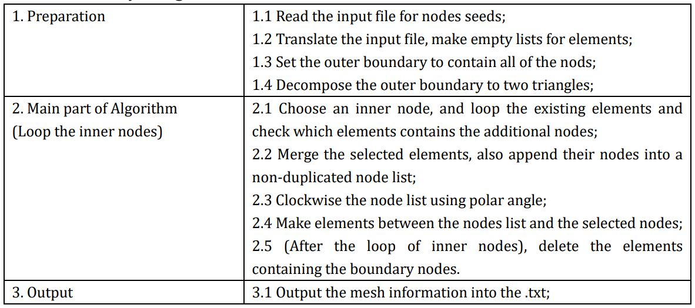

# CEEHW
Author: CHEN Jiawei, 2nd year master student at the University of Tokyo

### Features
This is a repo to manage the HW of one of my attended courses.
Here are the features of this repo: 
- PDE problem: 1D Wave static, 1D Wave dynamic, 2D Poisson static, Time integration scheme, Absorbing boundary condition.
- Matrix solver: Gauss pivot elimination algorithm, Conjugate gradient algorithm, matrix basic operation.
- Mesh generation: 2D Delaunay triangulation.
- Database: basic and simple data format, database, I/O for FEM.

### PDE problem:
command line for VS: 
```buildoutcfg
fem directoryOfInputFile directoryOfOutputFile
```
- The routine to solve the FEM problem:


- Case One - 2D Poisson Static:


- Case Two - 1D Wave Static:


- Input and Output format:
Input:
```buildoutcfg
mesh meshId dimension elemType nodeNum elemNum boudaryNum
node nodeId nodeXCoor nodeYCoor
elem elemId elemNode1Id elemNode2Id elemNode3Id
boudhead boundaryId staticBoudaryNum dynamicBoundarySetNum
statboud nodeId boundaryVal
dynaboud time boundaryNumCurrStep
dynaboud nodeId boundaryVal
```
Input example for each type:
```buildoutcfg
mesh 1 1 line 21 20 20
node 1 0.0
elem 1 1 2
boudhead 1 0 20
statboud 2 0
dynaboud 0.0 1
dynaboud 1 -6.805092493832333e-10
```
Output:
```buildoutcfg
step stepIndex time timeCurrStep (if you use time integration scheme)
nodeName nodeXCoor nodeYCoor nodeVal
```

Output example:
```buildoutcfg
step 1 time 0.000000
x6 0.700000 0.200000 0.210770
```

### Matrix solver:
Gauss Pivot Elimination Solver and Conjugate Gradient Solver can be used to solve the FEM problem in this repo.
```buildoutcfg
int gaussianEliminationSolveMatrix(matrix* A, matrixInt* indexVec, matrix *result);
void conjugateSolveMatrix(const matrix systemMatrix, double tolerance, matrix* result);
```
Also, some basic matrix operations were built in this repo.
Here is the comparison of analytical results, numerical results from Gauss elimination solver and conjugate gradient 
solver for the 2D Poisson problem.


### 2D Delaunay triangulation:
command line for VS:
```buildoutcfg
tri directoryOfNodesSeedsFile directoryOfMeshOutputFile
```
Delaunay triangulation is a common but popular mesh generation algorithm for triangle
element. 2D mesh generator for triangle element is supported in this repo now.
This figure from my report helps you understand the route of Delaunay triangulation:

- Input and Output:
To do the Delaunay triangulation, the node seeds have to be input, here is the format:
```buildoutcfg
mesh meshid NodeNum 0 0
node nodeid nodeXCoor nodeYCoor
```
```buildoutcfg
mesh 1 6 0 0
node 1 0 0
node 2 1.0 0
node 3 1.0 1.0
node 4 0 1.0
node 5 0.3 0.8
node 6 0.7 0.2
```
The output format of Delaunay triangulation is 
exactly, the mesh used for FEM simulation. Also, remember the node sequence
of each element has to be clockwise for FEM simulation, which has been done in 
this program:
```buildoutcfg
mesh meshId dimension elemenType nodeNum elemNum 0
node nodeId nodeXCoor nodeYCoor
elem elemId node1Id node2Id node3Id
```
```buildoutcfg
mesh 1 1 tria 6 6 0
node 1 0.000000 0.000000
node 2 1.000000 0.000000
node 3 1.000000 1.000000
node 4 0.000000 1.000000
node 5 0.300000 0.800000
node 6 0.700000 0.200000
elem 1 5 3 4
elem 2 5 4 1
elem 3 6 3 5
elem 4 6 5 1
elem 5 6 1 2
elem 6 6 2 3
```
- Case One - A very simple 2D mesh:


- Case Two - 2D mesh in 1x1 area:


